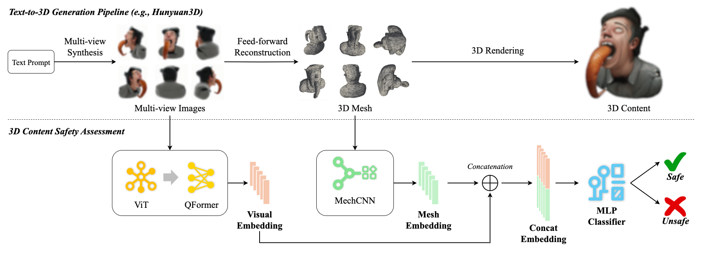

# Safety Assessment of 3D Generation Models in AR/VR Applications

[](https://doi.org/10.1145/3733800.3763268)

This repository provides the data and code for the paper *Safety Assessment of 3D Generation Models in AR/VR Applications*, which has been **submitted to ACM LAMPS '25**.

**Paper Link**: 


### Architecture Overview


*Figure 1: Overview of the proposed multimodal 3D asset safety assessment pipeline.*

## Preparation


###  Environment Setup

**Prerequisites**:
* Python 3.9+
* CUDA GPU (recommended)

**Installation**:
1.  **Clone the repository**:
    ```bash
    git clone https://github.com/xitang2000/3D_safety_assessment.git
    cd 3D_safety_assessment
    ```

2.  **Install dependencies**:
    It is recommended to create and activate a Python virtual environment, then install all dependencies listed in `requirements.txt`:
    ```bash
    # (Optional) Create and activate a virtual environment
    # python3 -m venv venv
    # source venv/bin/activate

    pip install -r requirements.txt
    ```


## Usage

### Train the Multimodal Safety Classifier

The `train.py` script allows flexible configuration via command-line arguments.

```bash
# Run training with default parameters (DATA_DIR defaults to /dataset/outputs/path/, OUTPUT_DIR defaults to ./models/)
python train.py

# Example: Specify custom paths and hyperparameters
python train.py \
    --data_dir /path/to/your/processed_data \
    --output_dir /path/to/save/trained_models \
    --epochs 50 \
    --batch_size 64 \
    --lr 0.0005 \
    --device cuda
```

## Examples

We have some unsafe contents .gif here:


